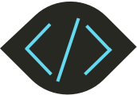

<div align="center">
<a href="https://github.com/tophat/codewatch">

</a>

[](https://pypi.org/project/codewatch/)
[](https://codecov.io/gh/tophat/codewatch)
[](https://circleci.com/gh/tophat/codewatch)
[](https://greenkeeper.io/)
<br />

[](https://opensource.tophat.com/slack)
<a href="#contributors">
    
</a>
[](https://opensource.org/licenses/Apache-2.0)
[](https://github.com/tophat/getting-started/blob/master/scorecard.md)

</div>

# Overview

_Monitor and manage deeply customizable metrics about your python code using ASTs._

Codewatch lets you write simple python code to track statistics about the state of your codebase and write lint-like assertions on those statistics. Use this to incrementally improve and evolve the quality of your code base, increase the visibility of problematic code, to encourage use of new patterns while discouraging old ones, to enforce coding style guides, or to prevent certain kinds of regression errors.

What codewatch does:
1. Traverses your project directory
2. Parses your code into AST nodes and calls your visitor functions
3. Your visitor functions run and populate a stats dictionary
4. After all visitor functions are called, your assertion functions are called
5. Your assertion functions can assert on data in the stats dictionary, save metrics to a dashboard, or anything you can think of

# Installation
Python: 2.7, 3.6, 3.7

Execute the following in your terminal:

```bash
pip install codewatch
```

# Usage

`codewatch codewatch_config_module`

`codewatch_config_module` is a module that should contain your visitors, assertions and filters (if required)

### Visitors
You should use the `@visit` decorator.
The passed in node is an [astroid](https://astroid.readthedocs.io/en/latest/) node which follows a similar API to `ast.Node`

```python
from codewatch import visit


def _count_import(stats):
    stats.increment('total_imports_num')

@visit('import')
def count_import(node, stats, _rel_file_path):
    _count_import(stats)

@visit('importFrom')
def count_import_from(node, stats, _rel_file_path):
    _count_import(stats)
```

This will build a stats dictionary that contains something like the following:

```json
{
    "total_imports_num": 763
}
```

### Assertions
Once again in the `codewatch_config_module` you can add assertions against this stat dictionary using the `@assertion` decorator

```python
from codewatch import assertion


@assertion()
def number_of_imports_not_too_high(stats):
    threshold = 700
    actual = stats.get('total_imports_num')
    err = 'There were {} total imports detected which exceeds threshold of {}'.format(actual, threshold)
    assert actual <= threshold, err
```

In this case, the assertion would fail since 763 is the `newStat` and the message:

```
There were 763 total imports detected which exceeds threshold of 700
```

would be printed

### Filters
You can add the following *optional* filters:

1. directory_filter (defaults to skip test and migration directories)

```python
# visit all directories
def directory_filter(_dir_name):
    return True
```

2. file_filter (defaults to only include python files, and skips test files)
```python
# visit all files
def file_filter(_file_name):
    return True
```

Tune these filters to suit your needs.


# Contributing
View our Code of Conduct [here](https://github.com/tophat/getting-started/blob/master/code-of-conduct.md)

## Running tests
Assuming you have a suitable python version with pip:

```bash
# setup
pip install -r requirements.txt -r requirements_test.txt

# run the tests!
pytest
```

# Contributors

Thanks goes to these wonderful people! ([Emoji key](https://github.com/kentcdodds/all-contributors#emoji-key))

<!-- ALL-CONTRIBUTORS-LIST:START - Do not remove or modify this section -->
<!-- prettier-ignore -->
<!-- ALL-CONTRIBUTORS-LIST:END -->

# Credits

Special thanks to [Carol Skelly](https://github.com/iatek) for donating the 'tophat' GitHub organization.
